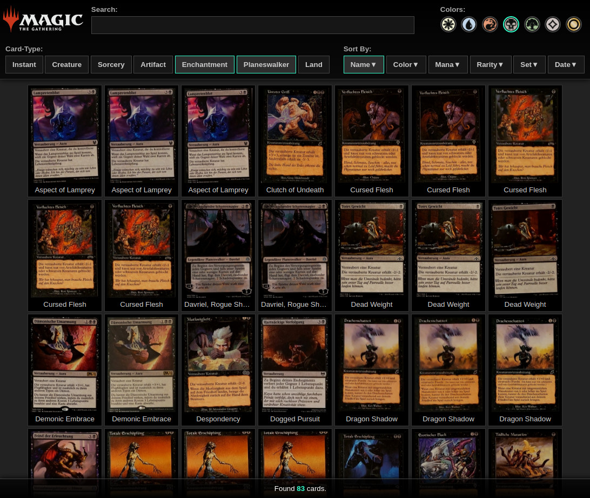
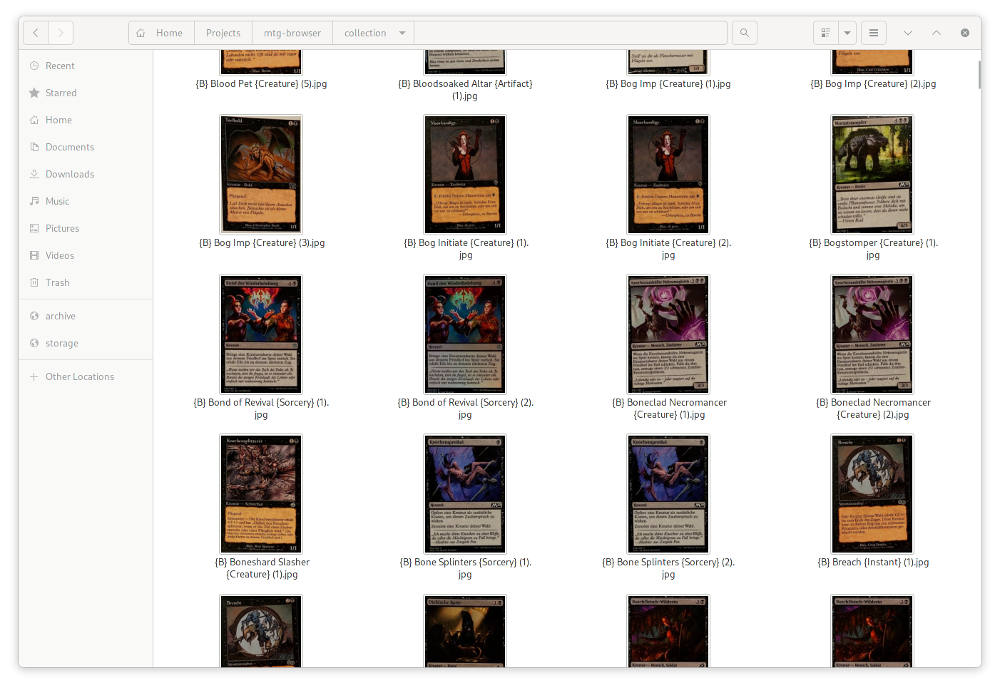

# mtg-browser

A small node.js project that allows to export your magic collection scans to your filesystem [1] and also provides a simple html-site [2] to filter and search for specific cards. The goal is it to make it easier to build decks out of your local collection (todo). This is the successor of [delver-export](https://github.com/shagu/delver-export).

## Supported Card Scanners

  - [DelverLens](https://www.delverlab.com/) - MTG Card Scanner

## Install

    git clone https://github.com/shagu/mtg-browser
    cd mtg-browser
    npm install

Now place your DelverLens backup file and the latest APK into the `input` directory (See [input/README.md](input/README.md) for details).
To process your collection, type `make`

    make

Possible `make` targets are:

  - `make` - *Runs update, clean and core*
  - `make update` - *Download MTGJSON data, extract Delver's built-in database and prepares your backup*
  - `make core` - *Only run the main programm*
  - `make clean` - *Clean the `./collection` folder*
  - `make distclean` - *Clean the `./collection` folder and reset everything done by `make update`*

## Preview

Once the `make` command returned successfully, the [index.html](index.html) can be opened in any browser, to display the frontend:

The files in the `./collection` folder, have the following format: `{Color} Name {Type} (count)`:

## Thanks

- **Delver Lens**
It's by far the best card scanner and organizer out there - even without being opensource (maybe one day?). If you have an Android-Phone and no card scanner yet, get it now! I have tried many apps, but delver lens stands out for its good organized interface, the card detection algorithm and especially the clean sqlite-export of collections.